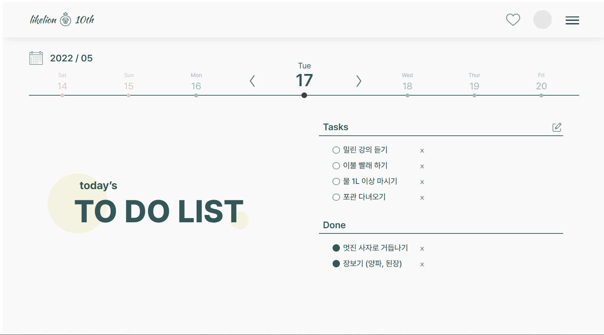

# 10th-Todo-publishing
프론트엔드 : Todo UI 퍼블리싱 과제 

#### 기획디자인 곽은진(geeeezin), 프론트엔드 이서진(529539)
    
    
    
### 🖥️ 완성본



### [netlify 링크](https://todo-geeeezin-529539.netlify.app/)

### ⛔ 미해결 이슈

- 리스트를 2개의 단으로 나누기
(4개 이상 작성되면 다음 단인 오른쪽으로 넘어가야 하는데 그냥 아래로 계속 이어짐.
조건문으로 5개부터 새로운 `<ul>`에 작성되게 하기? 도전은 해봤는데 아무튼 구현은 못함..)
    

    
- 리스트끼리 띄워두려고 `<li>`에 `line-height` 속성을 주었더니
하나의 `<li>` 내에서도 내용이 길어져 2줄로 넘어가면 줄간격이 너무 큼
또, 줄바꿈되었을 때 텍스트가 시작된 부분에서 2번째 줄이 시작되는 것이 아니라
`<li>`의 모양으로 주었던 체크박스 이미지 전까지 앞으로 붙어나옴
    

    
- 전부 `position: absolute;` 설정하여 픽셀로 위치를 설정함....
아직 `position: relative;` , `float` , `margin` , `padding` 사용하는게 어렵다🥲
- 스크린의 크기를 처음부터 `1920 × 1080px`로 설정해서 창을 전체화면으로 봐도 모니터 크기에 따라 스크롤이 생김ㅜㅜ
- 날짜별로 각각 새로운 투두를 작성할 수 없음
(오늘 하루치에만 고정되어 있음, 또 날짜가 자동으로 바뀌는 것까지는 구현하지 못하고
텍스트로 적어두기만 함..)

### 💡 어려웠던 점과 해결 방법

- Figma를 처음 사용해보는 것이었어서 처음엔 감이 안잡혔는데 열심히 구글링해가면서 해결했다.
FIgma to HTML이라는 플러그인을 발견해서 써봤는데
클래스, 아이디 이름도 뒤죽박죽이고 전부 div 태그에 CSS를 적용한 방식으로 변환되어서 결국 거의 새로 짜긴 했다. ㅎㅎ
그래도 Figma에서 바로 CSS 코드를 복사해서 쓸 수 있는건 완전 대박 편하고 좋았다!!👍
- 세션에서 짜뒀던 JavaScript 코드는 텍스트를 클릭했을 때 todo에서 done으로 토글되는 거였는데, 이 페이지를 구현할 때는 텍스트가 아니라 체크박스(빈 원 → 채워진 원)를 클릭했을 때 토글되어야 했어서 js 코드를 수정하는 것이 어려웠다.
    
    우선 리스트의 모양을 이미지로 바꿔야 했는데,
    
    ```jsx
    const newTodoCircle = document.createElement("img");
    newTodo.appendChild(newTodoCircle);
    
    newTodoCircle.className = "todo-circle";
    newTodoCircle.setAttribute("src", "images/circle_empty.png");
    newTodoCircle.addEventListener("click", toggleTodoToDone);
    ```
    
    `<li>` 안에 ``를 생성하고 속성에 이미지 경로를 준 뒤 이벤트를 추가하는 식으로 코드를 수정했다.
    
    여기서 원래는 텍스트를 클릭했기 때문에 바로 해당 `<span>` 안의 innerText를 출력하기만 하면 됐었는데, 지금은 ``를 클릭하는 것이기 때문에 토글 함수도 다음과 같이 수정했다.
    
    ```jsx
    const toggleTodoToDone = (e) => {
      deleteTodoItem(e);
      var li = e.target.parentNode;
      var text = li.childNodes[1];
      printDoneItem(text.innerText);
    };
    ```
    
    타겟인 ``의 부모 태그인 `<li>`를 저장해두고, `<li>`의 자손 노트 중 2번째 태그인 `<span>`을 따로 또 저장하여 innerText를 출력하게 했다.
    
    `toggleDoneToTodo`도 같은 방식으로 수정하니까 원하는 결과를 얻을 수 있었다.🎉

---
##수정 이후


### [vercel 링크](https://)

### 💡 해결 완료한 이슈들

1. **리스트를 2개의 단으로 나누기**

```css
display: flex;
align-content: flex-start;
flex-direction: column;
flex-wrap: wrap;
overflow: auto;
column-gap: 30px;
width: 900px;
```

`<ul>`에 다음과 같은 CSS 속성을 부여하고 `<li>`에 `display: block;`과 `width` 값을 줌
이때 `<ul>`의 `width` 값 = (`<li>`의 `width` 값 × 단의 개수) + 기타 `gap`, `padding` 값

> 여기서 `column-count = 2;`를 주면 세로로 내려가고 5번째부터 단이 바뀌는 것이 아니라
1 2 / 3 4 / 5 6 / 7 8 과 같이 오른쪽 아래 방향($\searrow$)으로 작성되었기 때문에 `flex`를 사용함
> 
2. **리스트의 줄간격**

```css
padding-top: 10px;
float: left;
overflow: auto;
```

`<span>`(텍스트)의 CSS 속성에서 `line-height` 대신 `float: left;`와 `padding-top`으로 줄간격을 맞추고
`overflow: auto;`를 통해 2줄 이상 넘어가면 스크롤이 생기도록 함

3. **최대 작성 가능한 리스트 개수 설정하기**

```jsx
const addTodoItem = () => {
  todoListNum = document.querySelector(".todo-list").childElementCount;
  event.preventDefault();
  const todoContent = document.querySelector(".todo-input").value;
  if (todoContent && todoListNum <= 8) printTodoItem(todoContent);
  else alert("최대 8개까지만 입력할 수 있습니다.");
};
```

`childElementCount`을 사용해서 `<li>`의 개수를 세고, 조건문 if를 통해 최대 개수를 넘기면 팝업으로 알리고 더이상 입력받지 못하게 함

4. **자동으로 오늘 날짜 불러오기**
    
```jsx
let now = new Date();
let year = now.getFullYear();
let month = now.getMonth() + 1;
let date = now.getDate();
let today = document.querySelector(".today");
const week = ["Sun", "Mon", "Tue", "Wed", "Thu", "Fri", "Sat"];
let day = now.getDay();
    
document.getElementById("date-title").innerHTML = year + " / " + month;
    
document.getElementById("num-b3").innerHTML = date - 3;
if (day < 3) document.getElementById("day-b3").innerHTML = week[day - 3 + 7];
else document.getElementById("day-b3").innerHTML = week[day - 3];
    
document.getElementById("num-b2").innerHTML = date - 2;
if (day < 2) document.getElementById("day-b2").innerHTML = week[day - 2 + 7];
else document.getElementById("day-b2").innerHTML = week[day - 2];
    
document.getElementById("num-b1").innerHTML = date - 1;
if (day < 1) document.getElementById("day-b1").innerHTML = week[day - 1 + 7];
else document.getElementById("day-b1").innerHTML = week[day - 1];
    
document.getElementById("num-today").innerHTML = date;
document.getElementById("day-today").innerHTML = week[day];
    
document.getElementById("num-a1").innerHTML = date + 1;
if (day > 5) document.getElementById("day-a1").innerHTML = week[day + 1 - 7];
else document.getElementById("day-a1").innerHTML = week[day + 1];
    
document.getElementById("num-a2").innerHTML = date + 2;
if (day > 4) document.getElementById("day-a2").innerHTML = week[day + 2 - 7];
else document.getElementById("day-a2").innerHTML = week[day + 2];
    
document.getElementById("num-a3").innerHTML = date + 3;
if (day > 3) document.getElementById("day-a3").innerHTML = week[day + 3 - 7];
else document.getElementById("day-a3").innerHTML = week[day + 3];
```
    

오늘 날짜뿐만 아니라 이전 3일, 다음 3일까지 모두 날짜와 요일을 가져와야 했는데,
배열의 인덱스가 그 길이의 범위를 벗어나면 undefined가 뜨는 문제가 발생하여
날짜마다 조건과 연산을 모두 다르게 각각 설정해줌
(나누기 연산을 썼다면 좀 더 효율적이었을 듯..)

5. **스크롤 바 없애기**

```css
body {
  -ms-overflow-style: none;
  scrollbar-width: none;
}
body::-webkit-scrollbar {
  display: none;
}
```

스크롤 바는 사라지지만 스크롤은 가능!

### ⛔ 미해결 이슈

- 새로고침해도 사라지지 않도록 todo 저장
    - [**LocalStorage에 todo 데이터를 저장**](https://velog.io/@chloe_park/Javascript-10.todo-list-%EC%83%88%EB%A1%9C%EA%B3%A0%EC%B9%A8%ED%95%B4%EB%8F%84-%EC%A0%80%EC%9E%A5%ED%95%98%EA%B8%B0)
